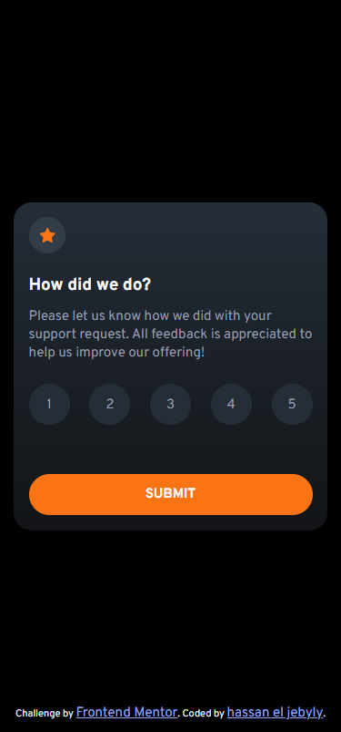

# Frontend Mentor - Interactive rating component solution

This is a solution to the [Interactive rating component challenge on Frontend Mentor](https://www.frontendmentor.io/challenges/interactive-rating-component-koxpeBUmI).
Frontend Mentor challenges help you improve your coding skills by building realistic projects.

## Table of contents

- [Overview](#overview)
  - [The challenge](#the-challenge)
  - [Screenshot](#screenshot)
  - [Links](#links)
- [My process](#my-process)
  - [Built with](#built-with)
  - [What I learned](#what-i-learned)
  - [Continued development](#continued-development)
  - [Useful resources](#useful-resources)
- [Author](#author)
- [Acknowledgments](#acknowledgments)

## Overview

### The challenge

Users should be able to:

- View the optimal layout for the app depending on their device's screen size
- See hover states for all interactive elements on the page
- Select and submit a number rating
- See the "Thank you" card state after submitting a rating

### Screenshot




### Links

- Solution URL: [Add solution URL here](https://your-solution-url.com)
- Live Site URL: [Add live site URL here](https://your-live-site-url.com)

## My process

### Built with

- Semantic HTML5 markup
- CSS custom properties
- Flexbox
- Mobile-first workflow

### What I learned

without adding tabindex attribute the :focus won't work

```html
<ul class="rating-card__rating-list" id="rating-card__rating-list">
  <li role="option" tabindex="1" class="rating-card__rating-list-item">1</li>
  <li role="option" tabindex="2" class="rating-card__rating-list-item">2</li>
  <li role="option" tabindex="3" class="rating-card__rating-list-item">3</li>
  <li role="option" tabindex="4" class="rating-card__rating-list-item">4</li>
  <li role="option" tabindex="5" class="rating-card__rating-list-item">5</li>
</ul>
```

only took these two classes to perfectly center the rating card and there was no need to use media queries

```css
.container {
  height: 100%;
  padding: 0 1em;
  /*to center div with class "cards-container"*/
  display: grid;
  place-items: center;
  background-color: black;
}

.cards-container {
  max-height: 400px;
  max-width: 400px;
  height: 360px;
  width: 100%;
  border-radius: 20px;
  position: relative;
  overflow: hidden;
}
```

because selected rating is on focus a problem occurred,
when user clicks somewhere else it loses focus,
after searching I couldn't find a way to keep focus styles on when user clicks somewhere else.
so I had the idea that I just need to detect when mouse leaves ratingListContainer then get a list of currently
active element using document.activeElement then add to it the class .js-active which has same styles as focus,
but then if the user returned and selected another rating we will have two ratings with same styles, to overcome this issue
I just created the removeActiveClass() to loop on all rating list elements and remove the .js-active class.

```js
ratingListContainer.addEventListener("mouseleave", () => {
  /* 
  if no rating is selected it returned the body element,  
  which didn't have any classes so I just used that to indicate if any rating was selected or not, 
  body didn't have any classes, my targeted element did, not the optimal solution but did the job 
  */
  if (document.activeElement.classList.length === 0) return;
  document.activeElement.classList.add("js-active");
});

const removeActiveClass = () => {
  ratingOptionsList.forEach((option) => {
    option.classList.contains("js-active") === true ? option.classList.remove("js-active") : "";
  });
};
```

### Continued development

accessibility is something I still need to learn; I would rate the html 0/10 when it comes to accessibility.

### Useful resources

- [document.activeElement](https://developer.mozilla.org/en-US/docs/Web/API/Document/activeElement) - This helped me for overcoming that problem where I lose focus styles.

## Author

- Website - [hassan el jebyly](https://github.com/hassaneljebyly)
- Frontend Mentor - [@hassaneljebyly](https://www.frontendmentor.io/profile/hassaneljebyly)
- Twitter - [@HassanElJebyly](https://twitter.com/HassanElJebyly)
